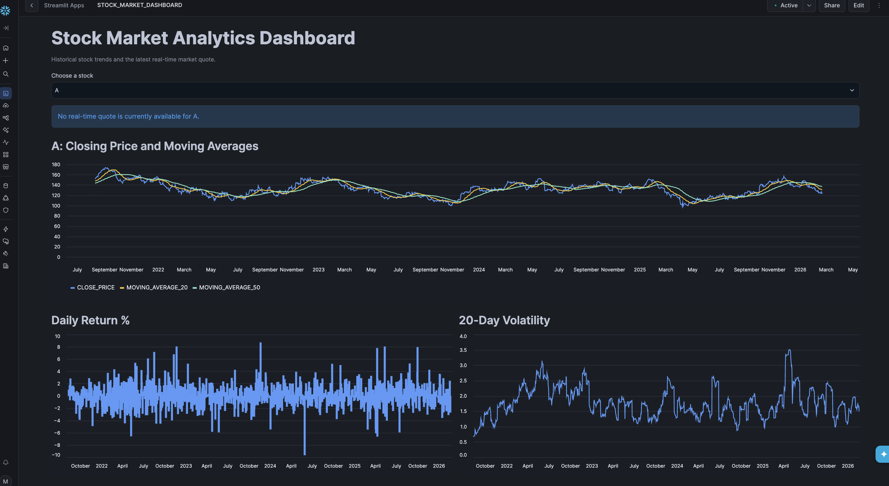
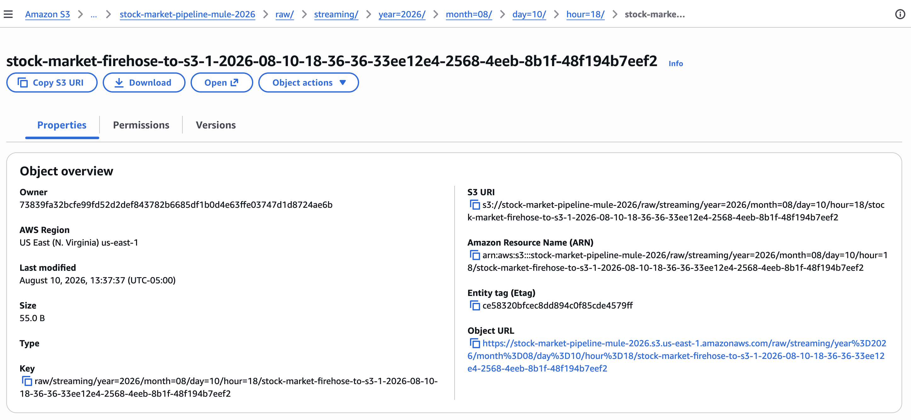
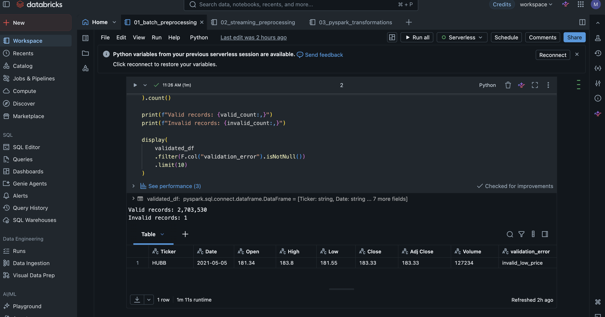
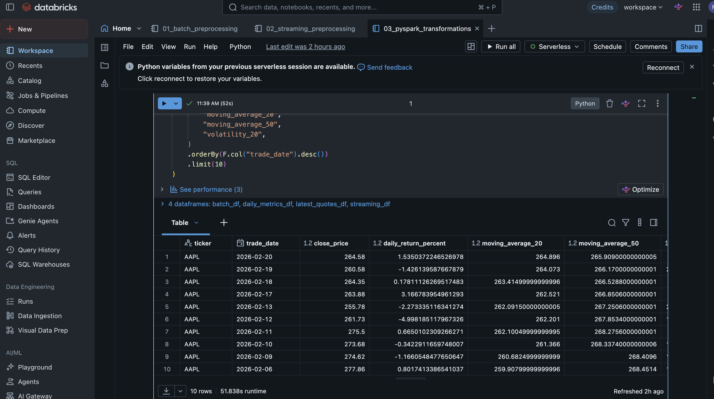
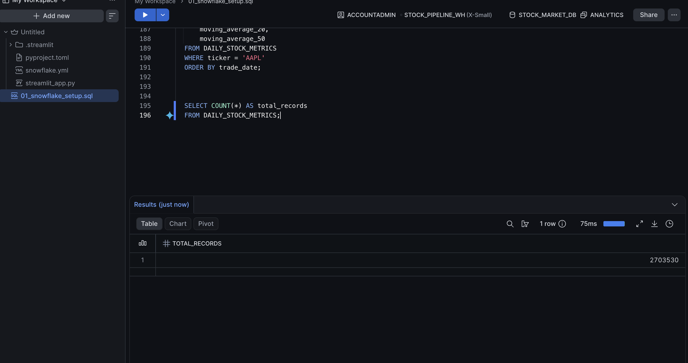

# Stock Market Data Engineering Pipeline

An end-to-end data engineering project that processes historical and real-time stock-market data for analytics and dashboard reporting.
## Project Screenshots

These screenshots show the project working from data collection to the final dashboard.

### Final Dashboard

This is the final dashboard. It shows the selected stock’s price trend, moving averages, daily return, volatility, and latest real-time quote.



### Real-Time Data in AWS S3

This shows that real-time stock data came through the AWS streaming pipeline and was saved in the S3 raw-data folder.



### Data Validation in Databricks

This shows that Databricks checked the historical stock data. Almost all records were valid, and the one bad record was separated instead of being used.



### Stock Metrics Created with PySpark

This shows the cleaned stock data after PySpark created useful values such as daily return, moving averages, and volatility.



### Data Loaded into Snowflake

This shows that Snowflake successfully loaded 2,703,530 historical stock records for analysis.




## Architecture

```text
Kaggle Historical CSV ─┐
                       ├─> Amazon S3 (raw data)
Finnhub API → Lambda → Kinesis → Firehose ┘
                                  ↓
                     Databricks validation and preprocessing
                                  ↓
                      Amazon S3 (processed Parquet)
                                  ↓
                     PySpark transformations in Databricks
                                  ↓
                       Amazon S3 (curated Parquet)
                                  ↓
                            Snowflake tables
                                  ↓
                      Snowflake Streamlit dashboard
```

## Technologies Used

- AWS S3 — raw, processed, curated, and quarantine storage
- AWS Lambda — calls the Finnhub stock-price API
- Amazon Kinesis Data Streams — receives real-time quote events
- Amazon Data Firehose — delivers streaming events into S3
- Amazon EventBridge Scheduler — invokes Lambda every minute
- Databricks — data preprocessing, validation, and PySpark transformations
- Snowflake — analytics warehouse and data loading
- Streamlit in Snowflake — dashboard for stock trends and real-time quotes
- Kaggle — historical S&P 500 stock-price CSV data
- Finnhub — real-time market data API

## Data Pipeline

1. Historical Kaggle CSV data is uploaded to the S3 raw batch area.
2. Finnhub provides real-time AAPL quotes.
3. Lambda sends each quote to Kinesis; Firehose writes the events to the S3 raw streaming area.
4. Databricks validates and cleans batch and streaming data.
5. Clean data is written to S3 in Parquet format; invalid data is sent to a quarantine area.
6. PySpark creates daily returns, moving averages, daily range, and volatility metrics.
7. Snowflake loads both processed and curated Parquet datasets.
8. A Streamlit dashboard presents historical trends and the latest market quote.

## Snowflake Tables

- `PROCESSED_STOCK_PRICES`
- `PROCESSED_STOCK_QUOTES`
- `DAILY_STOCK_METRICS`
- `LATEST_STOCK_QUOTES`

## Dashboard Features

- Stock selector
- Latest real-time stock price and daily change
- Closing price with 20-day and 50-day moving averages
- Daily return chart
- 20-day volatility chart
- Latest real-time quote table

## Data Quality

The batch validation checked 2,703,531 historical records:

- Valid records: 2,703,530
- Invalid records: 1
- Invalid record was quarantined instead of being included in analytics data.

## Security

API keys, AWS credentials, local data files, and virtual-environment files are excluded from this repository.